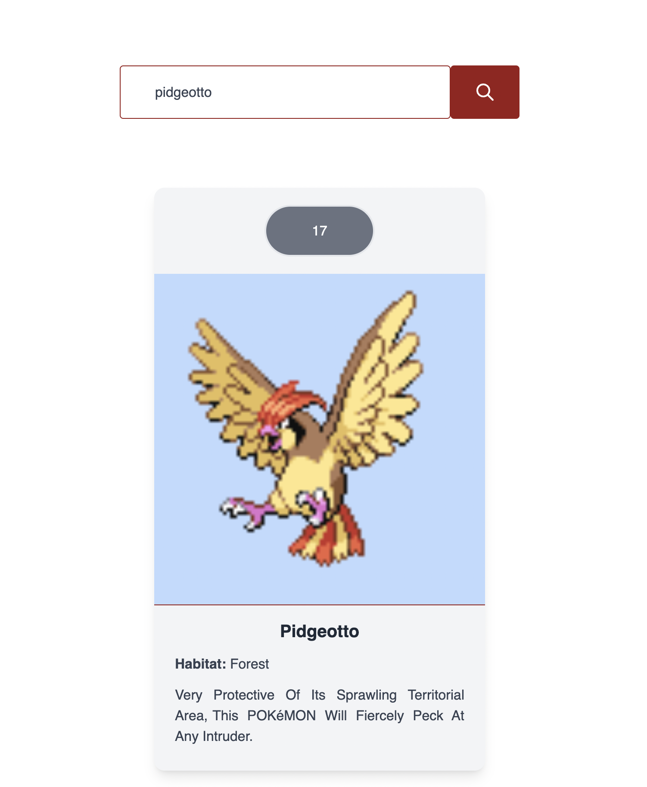
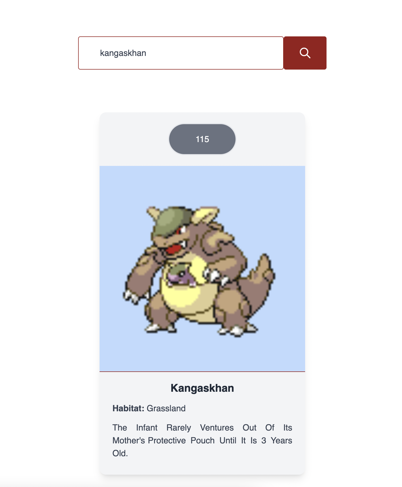

## Web Dex Project
  

Web Dex is a web application that finds a description, an image and a habitat of pokémon. All the user need is type on search field.

You can run this project with these commands after clone on github: 
```bash
npm run dev
#or
yarn dev
```

Open [http://localhost:3000](http://localhost:3000) with your browser to see the result.

## The search field
You can search any pokémon typing in search field. This application only accept the lowcase write.

## Images



